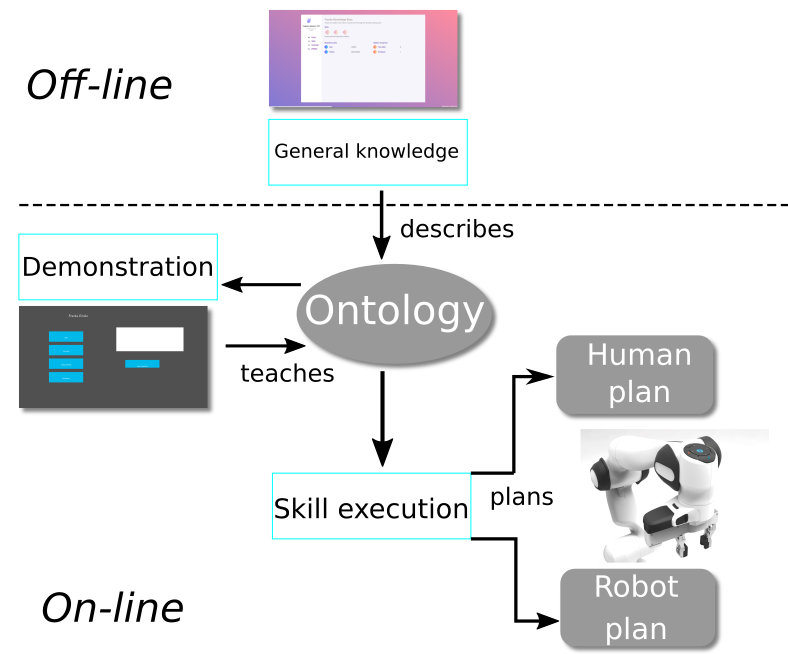
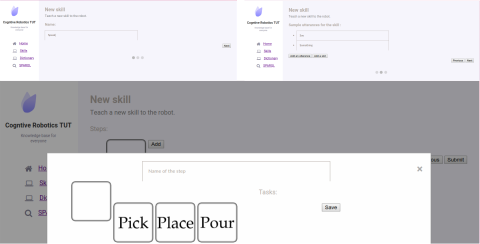
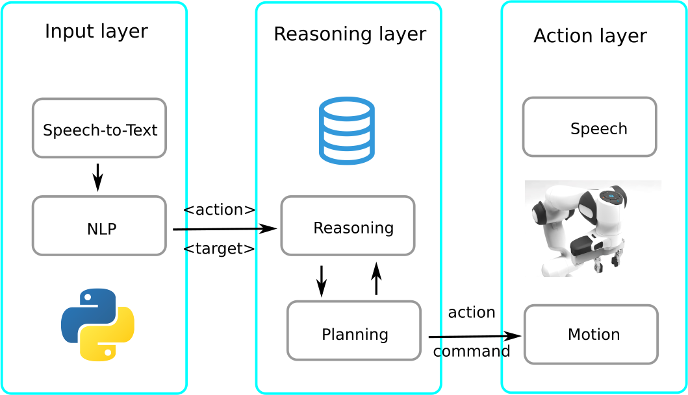
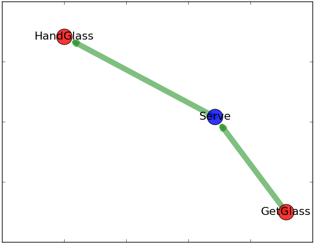

Overview
========

    General organization of the collaborative platform. Skill description occurs off-line and independently of the robot used. Operative knowledge is then demonstrated on-line. Finally the skills can be activated by natural language commands or through the GUI.

The knowledge base server
-------------------------

    Off-line web app allowing to describe new skills to the robot. The first step consists in naming the skill. The second step defines which command could activate it. Finally the different physical abilities involved in performing the skill can be specified. Our poll of predefined physical abilities is for now composed of picking, placing, and pouring.

The reasonning system
---------------------

    Our 3 layers approach allowing the robot to sense, think and act. The first layer listens for audio input from the environment. The second layer reasons about available skills and establish action plans. Finally the action layer handles the physical abilities implementations

Solving amgiguities
^^^^^^^^^^^^^^^^^^^

.. figure:: _static/bulle.png
    :align: center
    :scale: 25 %
    :figclass: align-center

    Grounding of a new symbol (spaghetti) in the knowledge base using human-robot interaction through natural language.

The system presented here allows a human to make simple queries to a robot. If they are not understood the robot asks for explanations about the unknown symbol(s).

The following use cases are considered for now :

 * Action is not understood. It needs to be defined with a sequence of actions already known. It can also be related to a skill already know through the command that would activate it.

 * Target is not understood. It can be defined either as a sub element or as an equivalent of a concept already known.

.. important::

   The system is highly dependent on the quality of the inputs provided to the robot. It is thus important that you make sure whether your microphone is good enough or not.

Collaborative task planning
^^^^^^^^^^^^^^^^^^^^^^^^^^^

    Plan made by the robot. In red is what will be performed by the robot and in blue what the human.
