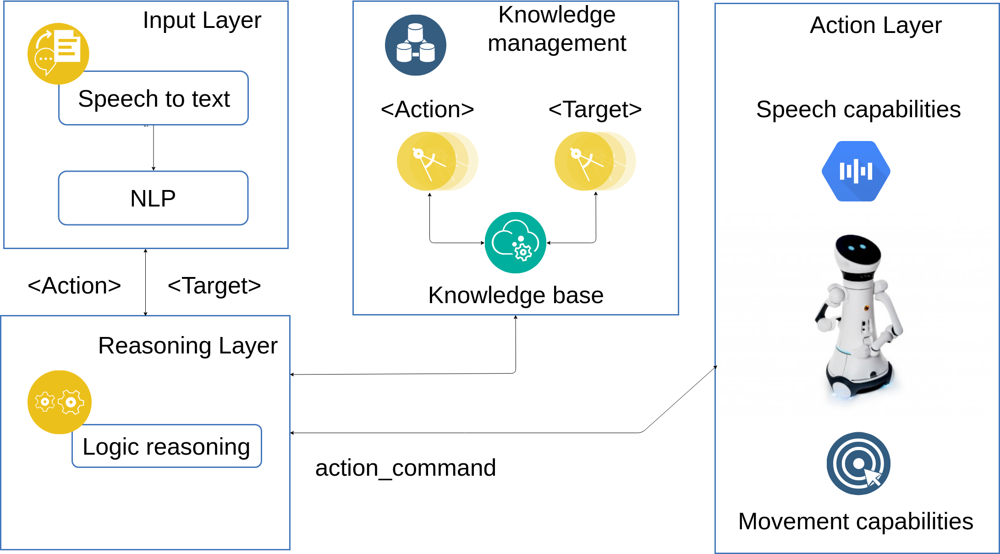

Overview
========

    Schematic overview of the components.

The system presented here allows a human to make simple queries to a robot. If they are not understood the robot asks
for explanations about the unknown symbol(s).

The following use cases are considered for now :

 * Action is not understood. It needs to be defined with a sequence of actions already known.

 * Target is not understood. It can be defined either as a sub element or as an equivalent of a concept already known.

.. important::

   The system is highly dependent on the quality of the inputs provided to the robot. It is thus important that you make sure
   whether your microphone is good enough or not.

The main components are:

* ``cogrob_tut_speech_recognition`` It makes a bridge between the user and the reasoning components of the robot. Its features are :

        * Speech to text conversion through Google's engine.

        * Processes the sentence by isolating each word of the sentence and ignoring the irrelevant ones.

        * Maintains a state machine updated after each perception which defines the different stages of the conversation.

* ``cogrob_tut_reasoning`` It uses a Prolog based reasoning to analyze the tokens it received from the speech recognition module. It is composed of :

        * **Knowledge base** containing information describing the environment, the robot, the different actions and targets. This information is stored in ontologies.

        * **Prolog libraries** linking the data and the rest of the program and hence called before each read or write operation in the ontologies.

        * **Grounding modules** that get activated when a teaching state is reached in the input layer.

        * **Kernel** and main entity, its only role is to distribute the tasks to the other components and sends the output of the reasoning layer.

        * **Data model** mirrors how the information is stored in the knowledge base. In other words it acts as a template that is used to shape the information from the code to the knowledge base or process it from the knowledge base to the code.
